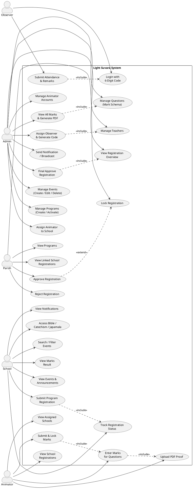
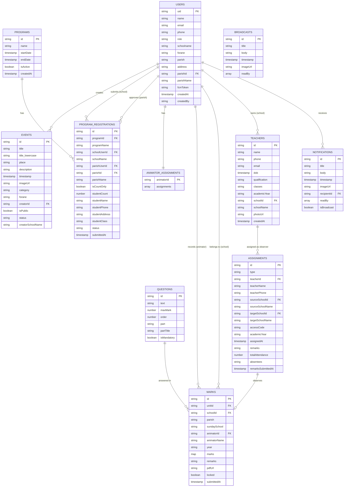

# 4. SYSTEM ANALYSIS AND DESIGN

## 4.1 Overall System Architecture

**Light Suvara** follows a **three-tier client-server architecture** with a cloud-native backend powered entirely by Firebase.

```
┌──────────────────────────────────────────────────────────────┐
│                     CLIENT TIER (Flutter)                    │
│  ┌──────────┐ ┌──────────┐ ┌───────────┐ ┌──────────────┐  │
│  │  Android │ │   iOS    │ │    Web    │ │ Windows/Mac  │  │
│  └──────────┘ └──────────┘ └───────────┘ └──────────────┘  │
│                  (Dart / Flutter 3.8+)                       │
│       State Management: Provider (ChangeNotifier)            │
└───────────────────────┬──────────────────────────────────────┘
                        │ HTTPS / WebSocket
┌───────────────────────▼──────────────────────────────────────┐
│                  BACKEND TIER (Firebase)                     │
│                                                              │
│  ┌───────────────┐  ┌───────────────┐  ┌─────────────────┐  │
│  │ Firebase Auth │  │   Firestore   │  │ Firebase Storage│  │
│  │ (email/pass)  │  │  (NoSQL DB)   │  │ (images, PDFs)  │  │
│  └───────────────┘  └───────────────┘  └─────────────────┘  │
│                                                              │
│  ┌───────────────┐  ┌───────────────┐  ┌─────────────────┐  │
│  │     FCM       │  │  Cloud Fns    │  │  App Check      │  │
│  │  (Push Notif) │  │  (Node.js)    │  │  (Security)     │  │
│  └───────────────┘  └───────────────┘  └─────────────────┘  │
└──────────────────────────────────────────────────────────────┘
```

### Architectural Layers

| Layer | Technology | Responsibility |
|---|---|---|
| **Presentation** | Flutter Widgets, Google Fonts, Lottie | Screens, UI components, animations |
| **State Management** | Provider (`UserDataProvider`, `ContentProvider`) | Shared state, auth observability |
| **Business Logic** | Dart (screen-level + service classes) | Workflow logic, validation, role routing |
| **Data Access** | `FirestoreService`, `cloud_firestore` SDK | CRUD operations, real-time streams |
| **Authentication** | Firebase Auth | Email/password login, session management |
| **Notifications** | `NotificationService`, FCM | Push delivery, topic routing |
| **File Storage** | Firebase Storage + `image_optimizer` | Image compression, PDF upload/download |
| **Cloud Functions** | Node.js (Firebase Functions) | Server-side event triggers (FCM dispatch) |

### Role-Based Routing

Upon successful login, `AuthWrapper` reads the user's `role` field from Firestore and routes to the appropriate dashboard:

```
Login Success
    │
    ▼
AuthWrapper reads role
    ├─ role = "admin"     → AdminDashboardScreen
    ├─ role = "parish"    → ParishDashboardScreen
    ├─ role = "animator"  → AnimatorDashboardScreen
    └─ role = "school"    → HomeScreen
                              │
                         (No auth) → ObserverPortal (6-digit code)
```

---

## 4.2 Module Description

The system is divided into **eight functional modules**:

### Module 1 — Authentication & Role Management
| Attribute | Details |
|---|---|
| **File** | `auth_screen.dart`, `auth_wrapper.dart` |
| **Purpose** | Email/password authentication; role-based screen routing |
| **Inputs** | Email, password |
| **Outputs** | Firebase Auth session; routes user to correct dashboard |
| **Key Logic** | `UserDataProvider` watches `authStateChanges()`, fetches Firestore user document, sets role flags (`isAdmin`, `isSchool`, `isParish`, `isAnimator`) |

### Module 2 — Admin Dashboard
| Attribute | Details |
|---|---|
| **Files** | `admin/admin_dashboard_screen.dart` + 17 sub-files |
| **Purpose** | Full system control |
| **Submodules** | Question Manager, Program Manager, Registration Manager, Assignment Manager, Animator Management, Teacher Management, Observer Management, Marks Viewer & PDF Generator, Event Management, Notification Sender |

### Module 3 — Parish Dashboard
| Attribute | Details |
|---|---|
| **Files** | `parish/parish_dashboard_screen.dart`, `parish_program_list_screen.dart` |
| **Purpose** | Intermediate approval layer for school registrations |
| **Key Workflow** | Review `pending_parish` registrations → Approve (→ `approved_parish`) or Reject (→ `rejected`); Lock approved entries (→ `locked`) |

### Module 4 — School Home Screen
| Attribute | Details |
|---|---|
| **File** | `homescreen.dart` (2,618 lines) |
| **Purpose** | Primary school-role interface |
| **Features** | Event feed with carousel and category filter, Program registration submission, Notification bell with unread count, Spiritual resources (Bible, Catechism, Japamala) |

### Module 5 — Animator Dashboard
| Attribute | Details |
|---|---|
| **Files** | `animator/animator_dashboard_screen.dart`, `mark_entry_screen.dart`, `student_registration_form.dart` |
| **Purpose** | Evaluate and record student marks for assigned schools |
| **Key Logic** | Fetch assignments from `animator_assignments`; enter marks per question part (I–V); upload PDF proof; lock after submission |

### Module 6 — Notification & Broadcast System
| Attribute | Details |
|---|---|
| **Files** | `services/notification_service.dart`, `notification_screen.dart`, `broadcast_screen.dart`, `admin/admin_notification_screen.dart` |
| **Purpose** | Push and in-app notifications; public broadcast channel |
| **Key Logic** | Cloud Functions trigger FCM on new Firestore document; `recipientId` routes to specific user (`[UID]`) or all schools (`role_school`); read receipts via `readBy` array |

### Module 7 — Observer Portal
| Attribute | Details |
|---|---|
| **Files** | `observer_remarks_login.dart`, `observer_remarks_screen.dart` |
| **Purpose** | Allow exam observers to submit attendance and remarks without Firebase Auth |
| **Key Logic** | 6-digit access code login; no account required; reports stored in `assignments` collection; global portal expiry date controlled by Admin |

### Module 8 — Utility & Shared Services
| Attribute | Details |
|---|---|
| **Files** | `utils/image_optimizer.dart`, `utils/pdf_download_helper.dart`, `utils/downloads_helper.dart`, `report_generator.dart`, `firestore_service.dart` |
| **Purpose** | Cross-cutting utilities used by all modules |
| **Features** | JPEG image compression, PDF generation & sharing, Firestore CRUD helpers |

---

## 4.3 Data Flow Diagram (Level 0 & Level 1)

### Level 0 — Context Diagram

The Level 0 DFD shows the entire system as a single process interacting with its external entities.

```
                          ┌─────────────────────────────────────────┐
                          │                                         │
  ┌──────────┐  events/   │                                         │  notifications  ┌──────────┐
  │  Admin   │◄──────────►│                                         │◄───────────────►│  School  │
  └──────────┘  reports   │                                         │  registrations  └──────────┘
                          │                                         │
  ┌──────────┐  approvals │     LIGHT SUVARA SYSTEM                 │  programs/marks ┌──────────┐
  │  Parish  │◄──────────►│                                         │◄───────────────►│ Animator │
  └──────────┘            │                                         │                 └──────────┘
                          │                                         │
  ┌──────────┐  remarks   │                                         │  FCM triggers   ┌──────────┐
  │ Observer │───────────►│                                         │◄───────────────►│ Firebase │
  └──────────┘            │                                         │                 └──────────┘
                          └─────────────────────────────────────────┘
```

**External Entities:**
- **Admin** — System owner; creates programs, questions, animator assignments, observer assignment and management, sends notification, manage programs, teacher management, user management, view evaluation done by animators
- **School** — Sunday School units; submit registrations, create events, receive notifications
- **Parish** — Intermediate approvers; approve/reject/lock registrations, view events created by the corresponding school
- **Animator** — Evaluators; enter marks for assigned schools
- **Observer** — Exam inspectors; submit attendance and remarks (code-based)
- **Firebase** — Cloud backend; stores data, sends notifications

---

### Level 1 — Expanded DFD

The Level 1 DFD breaks the central system into its major processes:

```
                 ┌──────────────────────────────────────────────────┐
  ┌───────┐      │                                                  │
  │       │─────►│  P1: Authentication & Role Routing               │
  │ User  │      │  (Firebase Auth + Firestore users)               │
  │       │◄─────│                                                  │
  └───────┘      └──────────────────┬───────────────────────────────┘
                                    │ role-based session
         ┌──────────────────────────▼─────────────────────────────┐
         │                                                         │
  ┌──────▼──┐   ┌──────────┐   ┌──────────┐   ┌───────────────┐  │
  │  P2:    │   │  P3:     │   │  P4:     │   │  P5:          │  │
  │ Event   │   │ Program  │   │ Marks    │   │ Notification  │  │
  │ Mgmt    │   │ Regist.  │   │ Entry    │   │ & Broadcast   │  │
  │         │   │ Workflow │   │ System   │   │               │  │
  └────┬────┘   └────┬─────┘   └────┬─────┘   └──────┬────────┘  │
       │             │              │                 │           │
       ▼             ▼              ▼                 ▼           │
  ┌─────────┐  ┌──────────┐  ┌──────────┐  ┌─────────────────┐  │
  │ events  │  │ program_ │  │  marks   │  │  notifications  │  │
  │  (FS)   │  │ registr. │  │   (FS)   │  │  broadcasts(FS) │  │
  └─────────┘  └──────────┘  └──────────┘  └─────────────────┘  │
                                                                  │
  ┌──────────┐   ┌──────────┐   ┌──────────────────────────────┐  │
  │  P6:     │   │  P7:     │   │  P8:                         │  │
  │ Teacher  │   │ Observer │   │ PDF / Report Generation      │  │
  │ & Assign │   │ Portal   │   │                              │  │
  └────┬─────┘   └────┬─────┘   └──────────────────────────────┘  │
       │              │                                            │
       ▼              ▼                                            │
  ┌──────────┐  ┌──────────┐                                       │
  │ teachers │  │ assignm. │                                       │
  │  (FS)   │  │  (FS)    │                                       │
  └──────────┘  └──────────┘                                       │
         └──────────────────────────────────────────────────────────┘
```

**Process Descriptions:**

| Process | Inputs | Outputs | Data Stores Accessed |
|---|---|---|---|
| P1 — Authentication | Email, Password | Session, Role flags | `users` |
| P2 — Event Management | Title, Date, Image, Category | Published event, Notifications | `events`, Storage |
| P3 — Registration Workflow | Student data, Parish approval | Status transitions | `program_registrations`, `programs` |
| P4 — Marks Entry | Question answers, PDF proof | Locked mark record | `marks`, `questions`, Storage |
| P5 — Notifications | Message, Recipient target | FCM push + in-app record | `notifications`, `broadcasts` |
| P6 — Teacher & Observer Assignment | Teacher info, Target school | Access code, Assignment record | `teachers`, `assignments` |
| P7 — Observer Portal | 6-digit code, Remarks | Attendance/remarks stored | `assignments` |
| P8 — Report Generation | Marks data, Year filter | PDF report file | `marks`, `questions` |

---

## 4.4 Use Case Diagram

> **Note for Diagram Generation (Claude):** Use the PlantUML code below to generate the Use Case Diagram. It defines all five actors and their associated use cases, including `<<extend>>` and `<<include>>` relationships.

### Actors
- **Admin** — Full system control
- **Parish** — Registration approval authority
- **School** — Sunday School units (students' representatives)
- **Animator** — Evaluator for assigned schools
- **Observer** — Exam inspector (code-based, no account)

### PlantUML Code



### Use Case Summary Table

| Actor | Use Cases |
|---|---|
| **Admin** | Manage events, programs, questions, animator accounts, teacher records, observer assignments; view/approve registrations; view all marks; generate PDFs; send notifications/broadcasts |
| **Parish** | View linked school registrations; approve, reject, or lock registrations; view programs |
| **School** | View & search events; submit program registrations; track registration status; view notifications; access Bible/Catechism/Japamala; view own marks |
| **Animator** | View assigned schools; enter marks per question; upload PDF proof; submit & lock marks; view school registrations |
| **Observer** | Login with 6-digit access code; submit attendance count, absentee list, and exam remarks |

---

## 4.5 Sequence Diagram

### SD-1: User Login and Dashboard Routing

```
User          AuthScreen         Firebase Auth       Firestore (users)      AuthWrapper
 │                │                    │                    │                    │
 │─ enter creds ─►│                    │                    │                    │
 │                │── signIn() ───────►│                    │                    │
 │                │                    │─ returns UserCred ─│                    │
 │                │◄─ auth success ────│                    │                    │
 │                │                    │                    │                    │
 │                │                    │── fetchUser(uid) ──►│                    │
 │                │                    │                    │─ user doc ─────────►│
 │                │                    │                    │                    │── read role
 │                │                    │                    │                    │── route to
 │                │                    │                    │                    │   dashboard
 │◄───────────────────────────────────────────────────────────────────────────────│
```

---

### SD-2: School Submits Program Registration

```
School          HomeScreen        Firestore(programs)   Firestore(registrations)   Parish
  │                  │                   │                        │                   │
  │─ open Programs ─►│                   │                        │                   │
  │                  │── query active ──►│                        │                   │
  │                  │◄─ program list ───│                        │                   │
  │─ fill form ──────►│                  │                        │                   │
  │                  │── add doc ─────────────────────────────────►│                   │
  │                  │                   │        status=pending_parish                │
  │◄─ success ───────│                   │                        │─── notify ────────►│
  │                  │                   │                        │                   │
  │                  │                   │                        │◄── approve() ─────│
  │                  │                   │                        │  status→approved_parish
  │                  │                   │                        │◄── lock() ────────│
  │                  │                   │                        │  status→locked    │
```

---

### SD-3: Animator Enters and Submits Marks

```
Animator     AnimatorDashboard   Firestore(questions)   Firestore(marks)    Firebase Storage
   │                │                    │                    │                    │
   │─ open school ─►│                    │                    │                    │
   │                │── fetch questions ►│                    │                    │
   │                │◄─ question list ───│                    │                    │
   │─ enter marks ─►│                    │                    │                    │
   │─ upload PDF ──►│                    │                    │── put(pdf) ───────►│
   │                │                    │                    │◄─ pdfUrl ──────────│
   │─ submit ───────►│                   │                    │                    │
   │                │── setDoc(marks) ──────────────────────►│                    │
   │                │                   │      locked=true, pdfUrl saved          │
   │◄─ success ─────│                   │                    │                    │
```

---

### SD-4: Admin Sends Notification / Broadcast

```
Admin       AdminNotificationScreen    Firestore(notifications)   Cloud Functions   FCM
  │                    │                         │                       │            │
  │─ compose msg ─────►│                         │                       │            │
  │─ select target ───►│                         │                       │            │
  │─ send ────────────►│                         │                       │            │
  │                    │── add doc ─────────────►│                       │            │
  │                    │                         │── onCreate trigger ──►│            │
  │                    │                         │                       │── sendMulticast()─►│
  │                    │                         │                       │            │─ push notif to devices
```

---

### SD-5: Observer Portal Login and Report Submission

```
Observer     ObserverLoginScreen     Firestore(assignments)    ObserverRemarksScreen
   │                 │                        │                         │
   │─ enter code ───►│                        │                         │
   │                 │── query accessCode ───►│                         │
   │                 │◄─ assignment doc ──────│                         │
   │                 │── check expiry date ──►│                         │
   │◄─ granted ──────│                        │                         │
   │─────────────────────────────────────────────────────────────────►│
   │─ enter remarks, attendance ─────────────────────────────────────►│
   │                 │                        │◄── update(doc) ────────│
   │                 │                        │  remarks, totalAttendance, absentees saved
   │◄───────────────────────────────────────────────────────────────── success
```

---

## 4.6 ER Diagram

> The following Mermaid ER diagram can be rendered in any Markdown viewer or pasted into [mermaid.live](https://mermaid.live/).



---

## 4.7 Database Design

The application uses **Cloud Firestore** (NoSQL document database) hosted in `nam5` (US Central) under Firebase project `sunday-school-8cde8`.

### Collection Overview

| # | Collection | Document ID | Purpose |
|---|---|---|---|
| 1 | `users` | Firebase Auth UID | User profiles, roles, FCM tokens |
| 2 | `events` | Auto-generated | School/admin event announcements |
| 3 | `programs` | Auto-generated | Competitive registration programs |
| 4 | `program_registrations` | Auto-generated | Student registrations with workflow |
| 5 | `notifications` | Auto-generated | Targeted push notification records |
| 6 | `broadcasts` | Auto-generated | Public announcement records |
| 7 | `animator_assignments` | Animator UID | Animator-to-school mapping |
| 8 | `marks` | `{schoolId}_{year}` | Evaluation results per school/year |
| 9 | `questions` | Auto-generated | Marks entry schema definition |
| 10 | `teachers` | Auto-generated | Teacher profiles per school |
| 11 | `assignments` | Auto-generated | Observer assignments with access code |

---

### Collection: `users`

| Field | Type | Description |
|---|---|---|
| `uid` | String | Same as Document ID |
| `name` | String | Full name or Sunday School name |
| `email` | String | Login email |
| `phone` | String | Contact number |
| `role` | String | `admin` / `school` / `parish` / `animator` |
| `schoolname` | String | Used by `school` role; indexed |
| `forane` | String | Forane organisation |
| `parish` | String | Parish name |
| `address` | String | Postal address |
| `parishId` | String | UID of associated parish user |
| `parishName` | String | Name of associated parish |
| `fcmToken` | String | FCM device token for push notifications |
| `createdAt` | Timestamp | Account creation (Animators) |
| `createdBy` | String | Admin UID who created the account |

---

### Collection: `events`

| Field | Type | Description |
|---|---|---|
| `title` | String | Event title |
| `title_lowercase` | String | Lowercase copy for search |
| `place` | String | Venue |
| `description` | String | Full details |
| `timestamp` | Timestamp | Scheduled date/time |
| `imageUrl` | String | Firebase Storage URL |
| `category` | String | `CML` / `Suvara` / `General` |
| `forane` | String | Regional filter |
| `creatorId` | String | UID of event creator |
| `isPublic` | Boolean | `false` = Draft |
| `status` | String | Lifecycle status |
| `creatorSchoolName` | String | Creator's display name |

---

### Collection: `programs`

| Field | Type | Description |
|---|---|---|
| `name` | String | Program title |
| `startDate` | Timestamp | Registration open date |
| `endDate` | Timestamp | Registration close date |
| `isActive` | Boolean | Visible to schools |
| `createdAt` | Timestamp | Audit timestamp |

---

### Collection: `program_registrations`

| Field | Type | Description |
|---|---|---|
| `programId` | String | Reference to `programs` doc |
| `programName` | String | Denormalized for display |
| `schoolUserId` | String | Submitting school's UID |
| `schoolName` | String | School name |
| `parishUserId` | String | Parish approver UID |
| `parishId` | String | Parish document UID |
| `parishName` | String | Parish name |
| `isCountOnly` | Boolean | Bulk registration mode |
| `studentCount` | Number | Total students (bulk mode) |
| `studentName` | String | Individual student name |
| `studentPhone` | String | Contact |
| `studentAddress` | String | Address |
| `studentClass` | String | Grade level |
| `status` | String | `pending_parish` / `approved_parish` / `locked` / `approved_admin` / `rejected` |
| `submittedAt` | Timestamp | Submission timestamp |

---

### Collection: `marks`

| Field | Type | Description |
|---|---|---|
| `unitId` | String | Assignment unit reference |
| `schoolId` | String | School UID |
| `parish` | String | Parish name |
| `sundaySchool` | String | School name |
| `animatorId` | String | Animator UID |
| `animatorName` | String | Animator display name |
| `year` | String | Academic year |
| `marks` | Map<String, Number> | Question ID → Score |
| `remarks` | String | Overall feedback |
| `pdfUrl` | String | Storage URL of proof PDF |
| `locked` | Boolean | Finalization flag |
| `submittedAt` | Timestamp | Submission timestamp |

---

### Collection: `questions`

| Field | Type | Description |
|---|---|---|
| `text` | String | Question / task description |
| `maxMark` | Number | Maximum score |
| `order` | Number | Display sequence |
| `part` | String | Part grouping (I, II, III, IV, V) |
| `partTitle` | String | Human-readable part title |
| `isMandatory` | Boolean | Mandatory flag (admin-controlled) |

---

### Collection: `notifications`

| Field | Type | Description |
|---|---|---|
| `title` | String | Heading |
| `body` | String | Message content |
| `timestamp` | Timestamp | Creation time |
| `imageUrl` | String | Optional banner image |
| `recipientId` | String | `[User UID]` for specific user; `role_school` for all schools |
| `readBy` | Array\<String\> | UIDs of users who read this |
| `isBroadcast` | Boolean | `true` for role-group delivery |

---

### Collection: `teachers`

| Field | Type | Description |
|---|---|---|
| `name` | String | Teacher full name |
| `phone` | String | Contact |
| `email` | String | Email |
| `dob` | Timestamp | Date of birth |
| `qualification` | String | Academic/professional qualification |
| `classes` | String | Subjects/classes taught |
| `academicYear` | String | e.g., `2024-25` |
| `schoolId` | String | Owning school UID |
| `schoolName` | String | School name |
| `photoUrl` | String | Firebase Storage URL |
| `createdAt` | Timestamp | Record creation timestamp |

---

### Collection: `assignments` (Observer)

| Field | Type | Description |
|---|---|---|
| `type` | String | Always `'Observer'` |
| `teacherId` | String | Teacher document ID |
| `teacherName` | String | Observer name |
| `teacherPhone` | String | Observer contact |
| `sourceSchoolId` | String | Observer's own school UID |
| `sourceSchoolName` | String | Observer's school name |
| `targetSchoolId` | String | School being observed UID |
| `targetSchoolName` | String | School being observed name |
| `accessCode` | String | 6-digit numeric code |
| `academicYear` | String | Assignment year |
| `assignedAt` | Timestamp | Assignment creation date |
| `remarks` | String | Exam remarks submitted |
| `totalAttendance` | Number | Attendance count |
| `absentees` | String | Names/details of absentees |
| `remarksSubmittedAt` | Timestamp | Report submission timestamp |

---

### Collection: `animator_assignments`

| Field | Type | Description |
|---|---|---|
| `assignments` | Array\<Map\> | List of assignment objects |
| `assignments[].unitId` | String | Unique assignment identifier |
| `assignments[].schoolUserId` | String | Assigned school UID |
| `assignments[].sundaySchool` | String | School name |
| `assignments[].parish` | String | Parish name |
| `assignments[].forane` | String | Forane name |
| `assignments[].year` | String | Academic year |

> **Note**: Each animator can have **max 2 assignments per academic year**.

---

### Composite Indexes

| Collection | Fields | Use Case |
|---|---|---|
| `events` | `creatorId`, `timestamp` | Load events by creator, newest first |
| `events` | `category`, `timestamp` | Filter events by category |
| `events` | `status`, `timestamp` | Filter by lifecycle status |
| `events` | `title_lowercase`, `timestamp` | Case-insensitive search |
| `events` | `isPublic`, `timestamp` | Show public events only |
| `users` | `role`, `schoolname` | School selection dropdowns |
| `notifications` | `recipientId`, `timestamp` | Load notifications for a user |
| `program_registrations` | `parishUserId`, `status`, `submittedAt` | Parish approval queue |
| `program_registrations` | `parishId`, `status`, `submittedAt` | Alternative parish filter |
| `programs` | `isActive`, `createdAt` | Active program listing |
| `teachers` | `schoolId`, `createdAt` | Load teachers by school |

---

### Firebase Storage Buckets

| Bucket Path | Contents |
|---|---|
| `event_images/` | Optimized JPEG event photos |
| `broadcast_images/` | Notification/broadcast banners |
| `marks_pdfs/` | Student proof PDFs uploaded by animators |
| `user_profiles/` | User/school profile pictures |

---

## 4.8 Algorithm / Pseudocode

### Algorithm 1: Program Registration Workflow (State Machine)

```
FUNCTION handleRegistrationSubmission(studentData, schoolUserId, programId):
    parishId ← getParishIdForSchool(schoolUserId)
    
    registration ← {
        programId:      programId,
        schoolUserId:   schoolUserId,
        parishUserId:   parishId,
        status:         "pending_parish",
        submittedAt:    now()
        ...studentData
    }
    
    addDocumentToFirestore("program_registrations", registration)
    sendNotificationToParish(parishId, "New registration pending your approval")
END FUNCTION

─────────────────────────────────────────────────────────────────────

FUNCTION parishApproveRegistration(registrationId, parishAction):
    IF parishAction == "APPROVE":
        updateField(registrationId, "status", "approved_parish")
    ELSE IF parishAction == "REJECT":
        updateField(registrationId, "status", "rejected")
    ELSE IF parishAction == "LOCK":
        IF currentStatus == "approved_parish":
            updateField(registrationId, "status", "locked")
            // School can no longer edit after this point
        ELSE:
            THROW Error("Can only lock approved registrations")
    END IF
END FUNCTION

─────────────────────────────────────────────────────────────────────

FUNCTION adminFinalApprove(registrationId):
    IF currentStatus IN ["locked", "approved_parish"]:
        updateField(registrationId, "status", "approved_admin")
    ELSE:
        THROW Error("Invalid state for admin approval")
END FUNCTION

─────────────────────────────────────────────────────────────────────

State Transition Diagram:
    pending_parish → approved_parish → locked → approved_admin
         └──────────────────────────────────────────► rejected
```

---

### Algorithm 2: Animator Assignment (Max 2 per Year)

```
FUNCTION assignAnimatorToSchool(adminInput):
    animatorId  ← adminInput.animatorId
    schoolId    ← adminInput.schoolId
    year        ← adminInput.year

    existingAssignments ← getDocumentFromFirestore("animator_assignments", animatorId)
    
    yearAssignments ← FILTER existingAssignments.assignments
                      WHERE assignment.year == year
    
    IF LENGTH(yearAssignments) >= 2:
        THROW Error("Animator has reached the maximum of 2 assignments for year " + year)
    END IF
    
    newUnit ← {
        unitId:        generateUUID(),
        schoolUserId:  schoolId,
        sundaySchool:  getSchoolName(schoolId),
        parish:        getSchoolParish(schoolId),
        forane:        getSchoolForane(schoolId),
        year:          year
    }
    
    updateDocument("animator_assignments", animatorId, {
        assignments: arrayUnion(newUnit)
    })
END FUNCTION
```

---

### Algorithm 3: Marks Entry and Locking

```
FUNCTION enterMarks(animatorId, schoolId, year, questionAnswers, pdfFile, remarks):
    // Step 1: Upload proof PDF
    pdfUrl ← uploadToStorage("marks_pdfs/" + schoolId + "_" + year + ".pdf", pdfFile)
    
    // Step 2: Validate marks against question schema
    questions ← fetchAllFromFirestore("questions")
    FOR EACH question IN questions:
        IF question.isMandatory AND questionAnswers[question.id] IS NULL:
            THROW Error("Mandatory question " + question.id + " not answered")
        END IF
        IF questionAnswers[question.id] > question.maxMark:
            THROW Error("Score exceeds maximum for question " + question.id)
        END IF
    END FOR
    
    // Step 3: Build marks document
    marksDoc ← {
        unitId:       getUnitId(animatorId, schoolId, year),
        schoolId:     schoolId,
        animatorId:   animatorId,
        year:         year,
        marks:        questionAnswers,   // Map<questionId, score>
        remarks:      remarks,
        pdfUrl:       pdfUrl,
        locked:       true,
        submittedAt:  now()
    }
    
    // Step 4: Store and lock
    docId ← schoolId + "_" + year
    setDocumentInFirestore("marks", docId, marksDoc)
    // After this point the record cannot be edited by the animator
END FUNCTION
```

---

### Algorithm 4: Notification Routing via FCM

```
// Cloud Function triggered on new document in "notifications" collection
FUNCTION onNotificationCreated(newDoc):
    recipientId ← newDoc.recipientId
    payload ← {
        title: newDoc.title,
        body:  newDoc.body,
        imageUrl: newDoc.imageUrl
    }
    
    IF recipientId STARTS WITH "role_":
        roleName ← SUBSTRING(recipientId, AFTER "role_")   // e.g., "school"
        FCM.sendToTopic("role_" + roleName, payload)
    ELSE:
        // Direct user notification
        userDoc ← getDocumentFromFirestore("users", recipientId)
        fcmToken ← userDoc.fcmToken
        FCM.sendToToken(fcmToken, payload)
    END IF
END FUNCTION

─────────────────────────────────────────────────────────────────────

// Cloud Function triggered on new document in "broadcasts" collection
FUNCTION onBroadcastCreated(newDoc):
    payload ← { title: newDoc.title, body: newDoc.body, imageUrl: newDoc.imageUrl }
    FCM.sendToTopic("broadcasts", payload)
END FUNCTION
```

---

### Algorithm 5: Image Upload with Optimization

```
FUNCTION uploadImage(rawImageFile, storagePath):
    // Step 1: Convert and compress
    compressedBytes ← ImageOptimizer.compress(rawImageFile,
        format:  JPEG,
        quality: 85      // percent
    )
    
    // Step 2: Upload to Firebase Storage
    storageRef ← FirebaseStorage.ref(storagePath)
    uploadTask  ← storageRef.putData(compressedBytes, metadata: "image/jpeg")
    
    // Step 3: Await completion and get download URL
    AWAIT uploadTask
    downloadUrl ← storageRef.getDownloadURL()
    
    RETURN downloadUrl
END FUNCTION
```

---

### Algorithm 6: Observer Portal Login (Code Verification)

```
FUNCTION observerLogin(enteredCode):
    // Step 1: Query assignments collection for matching code
    matches ← queryFirestore("assignments",
        WHERE "accessCode" == enteredCode,
        LIMIT 1
    )
    
    IF LENGTH(matches) == 0:
        RETURN { success: false, error: "Invalid access code" }
    END IF
    
    assignment ← matches[0]
    
    // Step 2: Check global portal expiry
    globalExpiry ← getAdminSetting("observerPortalExpiry")
    IF now() > globalExpiry:
        RETURN { success: false, error: "Observer portal is closed" }
    END IF
    
    // Step 3: Grant access
    RETURN { success: true, assignmentData: assignment }
END FUNCTION

─────────────────────────────────────────────────────────────────────

FUNCTION submitObserverReport(assignmentId, remarks, totalAttendance, absentees):
    updateDocumentInFirestore("assignments", assignmentId, {
        remarks:              remarks,
        totalAttendance:      totalAttendance,
        absentees:            absentees,
        remarksSubmittedAt:   now()
    })
END FUNCTION
```

---

*End of Chapter 4 — System Analysis and Design*
